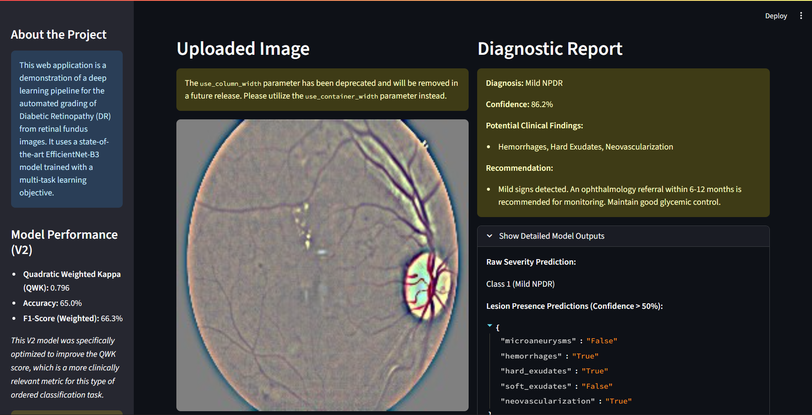

# Automated Diabetic Retinopathy Diagnosis AI
 
[](https://www.python.org/downloads/)
[](https://opensource.org/licenses/MIT)

An interactive web application for the automated grading of Diabetic Retinopathy (DR) from retinal fundus images. This project implements a complete deep learning pipeline, from model training and iterative improvement to a final, user-friendly Streamlit interface powered by a model hosted on Hugging Face Hub.

---

### App Screenshot



## 🌟 Features

- **Interactive UI:** Upload a retinal fundus image and receive an instant diagnostic assessment.
- **AI-Powered Diagnosis:** Utilizes a state-of-the-art `EfficientNet-B3` model fine-tuned for DR grading.
- **Detailed Reports:** Generates a Natural Language report including severity level, confidence, potential clinical findings, and a clinical recommendation.
- **Clinically-Relevant Performance:** The V2 model is optimized for Quadratic Weighted Kappa (QWK), a metric that better reflects clinical diagnostic agreement than standard accuracy.
- **Portable and Reproducible:** The application code is on GitHub, and the model is hosted on Hugging Face Hub, ensuring easy setup and deployment.

## 📂 Project Structure

```
DR_App/
├── .streamlit/
│   └── config.toml         # (Optional) Streamlit theme configuration
├── model/                  # (No longer needed, model is on HF Hub)
├── app.py                  # The main Streamlit application script
├── requirements.txt        # Python dependencies
└── README.md              # This file
```

## ⚙️ Setup and Installation

To run this application on your local machine, follow these steps.

**1. Clone the Repository:**
```bash
git clone https://github.com/dheeren-tejani/diabetic-retinopathy-classifier.git
cd diabetic-retinopathy-classifier
```

**2. Create and Activate a Virtual Environment (Recommended):**
```bash
# Create the environment
python -m venv venv

# Activate it
# On Windows:
venv\Scripts\activate
# On macOS/Linux:
# source venv/bin/activate
```

**3. Install Dependencies:**
The requirements.txt file contains all necessary libraries locked to compatible versions.
```bash
pip install -r requirements.txt
```

## ▶️ How to Run the App

Once the setup is complete, run the following command in your terminal from the project's root directory:

```bash
streamlit run app.py
```

Your web browser will automatically open, and you can start using the application.

## 🧠 Model Details and Iterative Improvement

This project involved two major iterations to create a diagnostically "smarter" model.

### V1: The Baseline
The initial model was trained on 224x224 images and achieved high accuracy by being very good at identifying healthy eyes (the majority class). However, it struggled to detect severe, vision-threatening cases.

### V2: The Clinically-Aware Model
The V2 model was engineered to fix the V1 model's weaknesses with several key interventions:
- **Higher Resolution (512x512):** To see finer pathological details.
- **Balanced Sampling:** A WeightedRandomSampler to force the model to pay attention to rare, severe classes.
- **Focal Loss:** A more advanced loss function to focus learning on "hard" examples.
- **Focused Objective:** Training was focused solely on the primary severity task.

### Performance Comparison

| Metric | V1 Model (224px) | V2 Model (512px, Balanced) | Change & Meaning |
|--------|------------------|---------------------------|------------------|
| Accuracy | 73.1% | 65.0% | **Decrease:** Expected, as the model stopped "playing it safe." |
| F1 (Weighted) | 73.9% | 66.3% | **Decrease:** Dragged down by new confusion in middle classes. |
| Quadratic Kappa | 76.1% | 79.6% | **SIGNIFICANT INCREASE:** The model now makes "smarter" errors, better aligning with clinical judgment. |

This trade-off is the core success of the project: we sacrificed naive accuracy to build a model that is significantly better at the real-world task of identifying high-risk patients.

## 🤗 Model Hosting on Hugging Face

The final V2 model (`best_model_v2.pth`), which is ~157MB, is too large for GitHub's file size limit. It is professionally hosted on the Hugging Face Hub.

You can find and download the model from the official repository here:
➡️ **Link to your Hugging Face Model Repository**

The `app.py` script automatically downloads this model the first time it is run.

## ⚠️ Disclaimer

This application is an academic project and is for educational and demonstration purposes only. It is **NOT** a medical device and should not be used for actual clinical diagnosis, treatment, or to replace the advice of a qualified healthcare professional.

## 🤖 Model Architecture and Training Details

```python
import torch
import torch.nn as nn
import torch.nn.functional as F
import timm
from PIL import Image
import numpy as np
import albumentations as A
from albumentations.pytorch import ToTensorV2
from huggingface_hub import hf_hub_download

# 1. Define the exact model architecture
class MultiTaskDRModel(nn.Module):
    # (Paste the full MultiTaskDRModel class definition from your app.py here)
    def __init__(self, model_name='efficientnet_b3', num_classes=5,
                 num_lesion_types=5, num_regions=5, pretrained=False):
        super(MultiTaskDRModel, self).__init__()
        self.backbone = timm.create_model(model_name, pretrained=pretrained, num_classes=0)
        self.feature_dim = self.backbone.num_features
        self.attention = nn.Sequential(
            nn.AdaptiveAvgPool2d(1), nn.Flatten(),
            nn.Linear(self.feature_dim, self.feature_dim // 8), nn.ReLU(inplace=True),
            nn.Linear(self.feature_dim // 8, self.feature_dim), nn.Sigmoid()
        )
        self.feature_norm = nn.BatchNorm1d(self.feature_dim)
        self.dropout = nn.Dropout(0.4)
        self.severity_classifier = nn.Sequential(
            nn.Linear(self.feature_dim, self.feature_dim // 2), nn.ReLU(inplace=True),
            nn.Dropout(0.2), nn.Linear(self.feature_dim // 2, num_classes)
        )
        self.lesion_detector = nn.Sequential(
            nn.Linear(self.feature_dim, self.feature_dim // 4), nn.ReLU(inplace=True),
            nn.Dropout(0.2), nn.Linear(self.feature_dim // 4, num_lesion_types)
        )
        self.region_predictor = nn.Sequential(
            nn.Linear(self.feature_dim, self.feature_dim // 4), nn.ReLU(inplace=True),
            nn.Dropout(0.2), nn.Linear(self.feature_dim // 4, num_regions)
        )
    def forward(self, x):
        features = self.backbone.forward_features(x); pooled_features = F.adaptive_avg_pool2d(features, 1).flatten(1)
        attention_weights = self.attention(pooled_features.unsqueeze(-1).unsqueeze(-1)); features = pooled_features * attention_weights
        features = self.feature_norm(features); features = self.dropout(features)
        severity_logits = self.severity_classifier(features); lesion_logits = self.lesion_detector(features); region_logits = self.region_predictor(features)
        return {'severity': severity_logits, 'lesions': lesion_logits, 'regions': region_logits, 'features': features}

repo_id = "dheeren-tejani/DiabeticRetinpathyClassifier"
filename = "best_model_v2.pth"
model_path = hf_hub_download(repo_id=repo_id, filename=filename)

# 3. Load the model
device = torch.device('cpu')
model = MultiTaskDRModel()
checkpoint = torch.load(model_path, map_location=device, weights_only=False)
model.load_state_dict(checkpoint['model_state_dict'])
model.to(device)
model.eval()

print("Model loaded successfully!")

# 4. Preprocess an image and run inference
def preprocess_image(image_path):
    transforms = A.Compose([
        A.Resize(512, 512),
        A.Normalize(mean=[0.485, 0.456, 0.406], std=[0.229, 0.224, 0.225]),
        ToTensorV2(),
    ])
    image = np.array(Image.open(image_path).convert("RGB"))
    image_tensor = transforms(image=image)['image'].unsqueeze(0)
    return image_tensor

# Example usage
# image_tensor = preprocess_image("path/to/your/image.png")
# with torch.no_grad():
#     outputs = model(image_tensor)
# predicted_severity = torch.argmax(outputs['severity'], dim=1).item()
# print(f"Predicted Severity Class: {predicted_severity}")
```

### Training Procedure
This model (V2) was trained to improve upon a baseline (V1) that struggled with severe-stage DR detection. The following key interventions were made:

- **Image Resolution:** Increased from 224x224 to 512x512 to capture finer pathological details.
- **Class Balancing:** A WeightedRandomSampler was implemented to oversample the rare minority classes (Severe and Proliferative DR) during training.
- **Loss Function:** The standard Cross-Entropy loss was replaced with a Focal Loss (γ=2.0) to focus the model on hard-to-classify examples. Class weights were computed dynamically based on the inverse frequency of the training data.
- **Focused Objective:** The loss weights for the auxiliary lesion and region heads were set to zero, forcing the backbone to dedicate its entire capacity to optimizing the primary severity task.

### Hyperparameters

| Parameter | Value |
|-----------|-------|
| Optimizer | AdamW |
| Learning Rate | 1e-4 |
| LR Scheduler | CosineAnnealingWarmRestarts (T_MAX=10) |
| Batch Size | 16 |
| Epochs | 17 (Stopped by Early Stopping) |
| Image Size | 512 |

### Evaluation Results
The model was evaluated on a held-out validation set of 735 images. The best checkpoint was selected based on the highest Quadratic Weighted Kappa (QWK) score achieved during training.

| Metric | Score |
|--------|-------|
| Quadratic Weighted Kappa (QWK) | 0.796 |
| Accuracy | 65.0% |
| F1-Score (Weighted) | 66.3% |
| F1-Score (Macro) | 53.5% |

The V2 model achieved a **+3.5% improvement in QWK** over the V1 baseline (0.761), indicating it makes "smarter" errors that are more aligned with clinical judgment, despite a lower overall accuracy.

## ⚠️ Limitations and Bias

- This model was trained on a single public dataset from a Kaggle competition. Its performance on images from different clinical settings, camera types, or patient demographics is not guaranteed.
- The dataset may have inherent demographic biases that are not documented.
- This model is **NOT** a medical device. It is a research project and should not be used for actual clinical diagnosis or to replace the judgment of a qualified medical professional.

## 📝 Citation

If you use this model in your work, please consider citing this repository.

```bibtex
@misc{dheerentejani-dr-model-2025,
  author = {Dheeren},
  title = {A Deep Learning Model for Diabetic Retinopathy Grading},
  year = {2025},
  publisher = {Hugging Face},
  journal = {Hugging Face repository},
  howpublished = {\url{https://huggingface.co/dheeren-tejani/DiabeticRetinpathyClassifier}},
}
```